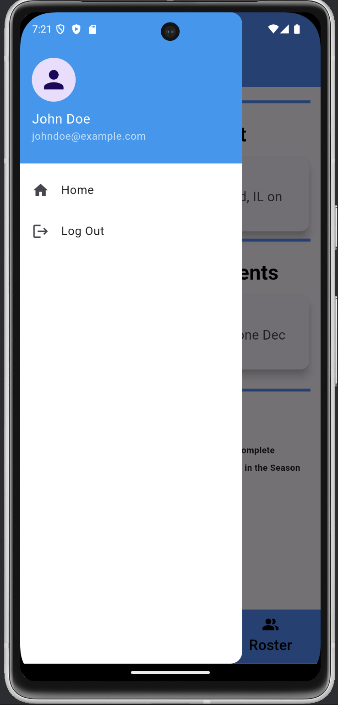

# Sports Team Organization App

This Flutter app is designed to help sports teams stay organized with features for player 
authentication, event scheduling, announcements, and roster management.

## Features 

### 1. **Authentication**
- **Sign Up and Login**:
    - Players can sign up or log in to their accounts.
    - Authentication uses the `sqflite: ^2.0.0+4` dependency for local storage.
- **Sign Up Process** includes the following validation checks:
  - **Blank fields**: Ensures that no fields are left empty.
  - **Unique email**: Checks that the email entered is not already registered.
  - **Password confirmation**: Verifies that the password entered matches the **confirm password** field.
- **Dynamic User Management**:
    - New player information is dynamically added to the SQL database upon sign-up.
    - Login credentials (email and password) are securely validated for returning users.

### 2. **Home Page**
- **Upcoming Events**:
    - Displays the next scheduled event, synced with the schedule.
- **Announcements**:
    - Currently static, but can be updated to dynamically reflect new information.
- **Season Progress**:
    - A dynamic pie chart (powered by `pie_chart: ^5.0.0`) visualizes the season's progress based on event dates.

### 3. **Navigation**
- A persistent hamburger menu on every screen includes:
    - Player information: first name, last name, and email.
    - Navigation buttons for the Home screen and Logout.

### 4. **Schedule Screen**
- **Event Listings**:
    - Displays events categorized by:
        - Today
        - Tomorrow
        - This Month
        - Next Month
    - Each event includes:
        - Title
        - Time
        - Date
        - Location
- Events are currently manually input for testing purposes.

### 5. **Roster Screen**
- **Dynamic Roster**:
    - Displays all team members, dynamically updated when a new player signs up.
- **Player Details**:
    - Clicking on a player's icon reveals a pop-up with their email and phone number.
- **Search Feature**:
    - Search for players by first or last name using the search icon.
    - View detailed information by selecting a player from the search results.

## Dependencies
The app uses the following Flutter dependencies:
- **`sqflite: ^2.0.0+4`**: Handles local data storage and authentication.
- **`pie_chart: ^5.0.0`**: Renders the pie chart for season progress visualization.
- **`intl: ^0.17.0`**: Manages and formats dates for event scheduling.

## Project File Structure 
- **lib file** :
  - Contains the main code for the app. This is where most of the Flutter-related files and Dart logic can be found.
- **assets file** :
  - Stores images
- **README.md** :
  - Provides an overview of the project

## Technologies Used
- **Flutter**: Framework for building the mobile application.
- **Dart**: The programming language used for backend logic and app development.
- **SQLite**: Used for local database storage of player information.
- **Pie Chart**: Displays progress of the season using the `pie_chart` dependency.
- **Intl**: Used for formatting dates.

## How to Use
1. Clone this repository to your local machine.
2. Open the project in Android Studio or your preferred Flutter IDE.
3. Run the app on an emulator or physical device.
4. Sign up or log in to explore the app's features.

## Screenshots
### Home Page

### Schedule Page

### Roster Page

### Login Screen

### Sign Up Screen

### Hamburger Menu

### Search Method

## Future Enhancements
- Dynamic schedule input for real-time event updates.
- Dynamic announcements to automatically reflect changes.
- Additional features for team communication and data export.

---

### Credits
Developed as a final project for the "Mobile Applications" course at Saint Mary's University of Minnesota.

---

Feel free to suggest any edits or let me know if you'd like additional sections added!

